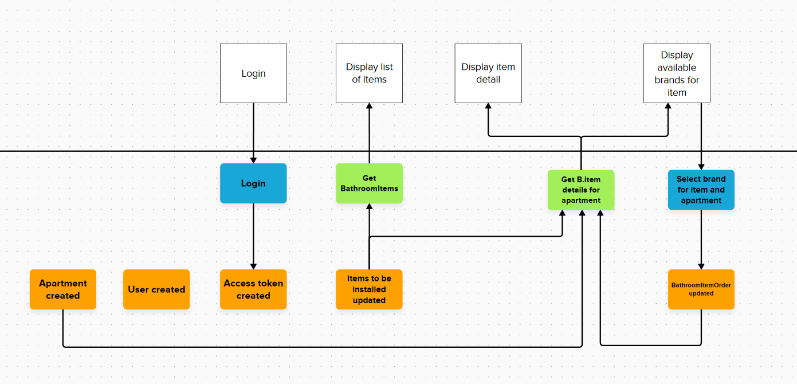

# Getting started

1. Install .NET SDK
2. Cd into solution root folder
3. Run `dotnet run --project BathroomRenovation --launch-profile https`
4. Open https://localhost:7177/swagger/index.html

## Event Modell

